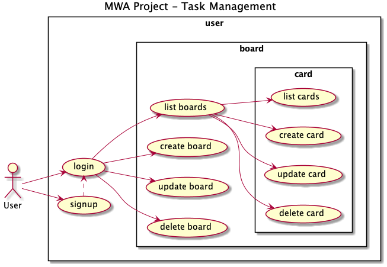

# probable-winner

* Team Lead: The Phu Nguyen
* Team Member: Stojan Terziev
* Team Member: Bayartsogt Yadamsuren

Contents:
- [x] UML
- [x] Backend Structure
- [x] Frontend Structure

## UML


## Backend Structure

```
├── models/
│   ├── board.js
│   ├── card.js
│   └── user.js
│
├── routers/
│   ├── keys/
│   │   └── public.pem
│   │   
│   ├── auth.js
│   ├── boards.js
│   ├── cards.js
│   ├── middleware.js
│   └── user.js
│
├── test/client_http/
│   ├── auth.http
│   ├── test.http
│   └── ...
│
├── .env
└── package.json
```

## Frontend Structure

```
├── app/
│   ├── src/
│   │   ├── app/
│   │   │   ├── components/
│   │   │   │   ├── board/
│   │   │   │   ├── card/
│   │   │   │   ├── signup/
│   │   │   │   ├── login/
│   │   │   │   ├── header/
│   │   │   │   ├── footer/
│   │   │   │   └── ...
│   │   │   ├── services/
│   │   │   │   ├── data-service.service.ts
│   │   │   │   ├── auth-service.service.ts
│   │   │   │   └── ...
│   │   │   ├── pipes/
│   │   │   │   ├── date-ago.pipe.ts
│   │   │   │   └── ...
│   │   │   ├── guards/
│   │   │   │   ├── auth.guard.ts
│   │   │   │   └── ...
│   │   │   ├── app.component.ts
│   │   │   ├── app.module.ts
│   │   │   └── page-routing.module.ts
│   │   ├── interceptors
│   │   ├── assets
│   │   └── ...
│   ├── favicon.ico
│   ├── index.html
│   ├── main.ts
│   └── ...
└── ...

```
